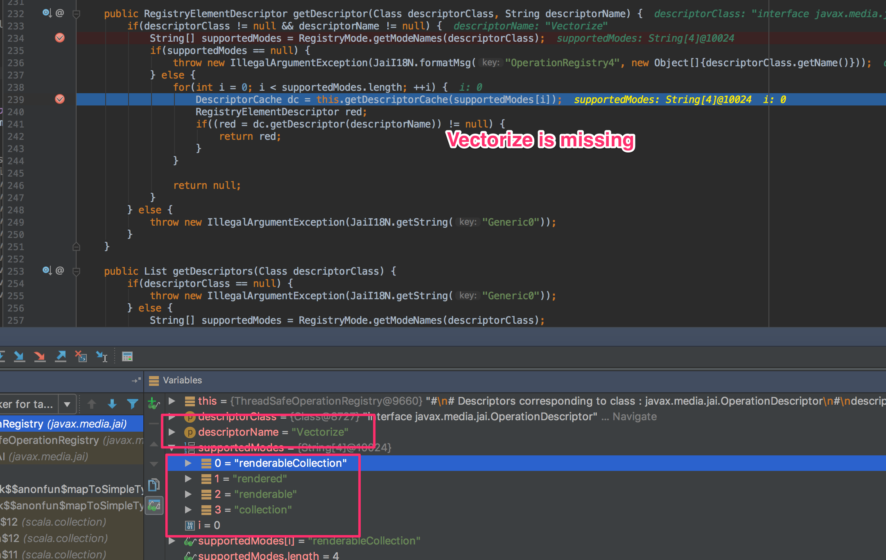

# jai native dependencies on imageio packaging problem

I want to use the java library JAI to parse some spatial raster files. Unfortunately, I face strange classpath issues.
JAI only works when running via the build tool i.e. `sbt run`. 


To demonstrate the error in spark:

```
spark-submit --verbose \
        --class geo.SparkDoesNotWork \
	target/scala-2.11/jaiPackagingProblems-assembly-0.0.1.SNAPSHOT.jar
```

which will throw some sort of null validation of the underling native geos api

```
java.lang.IllegalArgumentException: The input argument(s) may not be null.
	at javax.media.jai.ParameterBlockJAI.getDefaultMode(ParameterBlockJAI.java:136)
	at javax.media.jai.ParameterBlockJAI.<init>(ParameterBlockJAI.java:157)
	at javax.media.jai.ParameterBlockJAI.<init>(ParameterBlockJAI.java:178)
	at org.geotools.process.raster.PolygonExtractionProcess.execute(PolygonExtractionProcess.java:171)
```

To demonstrate that it works just fine in the build tool

```
sbt run
# choose 2 (second main class)
```
you will see the following output
```
[info] +--------------------+----+--------------------+
[info] |              idPath|  db|                 geo|
[info] +--------------------+----+--------------------+
[info] |file:/Users/geohe...|12.0|POLYGON ((3 1, 3 ...|
[info] |file:/Users/geohe...|10.0|POLYGON ((2 2, 1 ...|
[info] |file:/Users/geohe...| 9.0|POLYGON ((2 1, 2 ...|
[info] +--------------------+----+--------------------+
[info]
[info] 3
```


Now for the weird part: assuming the classpath is broken, this means when not using spark but a regular
java / scala function to parse the files it should fail as well:

```
java -jar target/scala-2.11/jaiPackagingProblems-assembly-0.0.1.SNAPSHOT.jar
```
however, it will output the result just fine

```
 ### file data/dummy2.asc with 3 polygonsGeometryId(/Users/geoheil/Downloads/dummy/spark/data/dummy2.asc,2.0,POLYGON ((3 0, 4 0, 4 3, 0 3, 0 0, 2 0, 2 1, 3 1, 3 0), (1 1, 1 2, 2 2, 2 1, 1 1)))
GeometryId(/Users/geoheil/Downloads/dummy/spark/data/dummy2.asc,1.0,POLYGON ((2 2, 1 2, 1 1, 2 1, 2 2)))
GeometryId(/Users/geoheil/Downloads/dummy/spark/data/dummy2.asc,1.0,POLYGON ((2 1, 2 0, 3 0, 3 1, 2 1)))
```

Is spark messing with the classpaths?

> The main parsing functionality is the same in both cases!

Also I found out when setting
```
val vectorizedFeatures = extractor.execute(rasterData, 0, true, null, null, classificationRanges, null).features
```

to

```
val vectorizedFeatures = extractor.execute(rasterData, 0, true, null, null, null, null).features
```
spark will not mess with the classpath / not throw the error. However, this option is mandatory for my project.

The problem sounds a bit similar to http://git.net/ml/geoserver-development-geospatial-java/2013-10/msg00251.html but I could not solve it yet.

# edit
Meanwhile I packaged the same parsing functionality for NiFi but I can observe the same problems i.e. that something is null which should not be null.


https://stackoverflow.com/questions/7051603/jai-vendorname-null sounds somewhat similar, though I could not find missing netries in the manifest. https://stackoverflow.com/questions/9010202/adding-vendor-information-to-manifest-mf-using-sbt-assembly shows how to add some with sbt and https://github.com/geoHeil/jai-packaging-problem/commit/bedf62a93ac5c48052a30cd342aa22603d1d44db checks that they really are present - no luck there.
This are the contents of the manifest. This looks like everything which should be there - is there.
```
Manifest-Version: 1.0
Implementation-Title: myLib
Implementation-Version: 0.0.1.SNAPSHOT
Specification-Vendor: imagio
Specification-Title: jaiPackagingProblems
Implementation-Vendor-Id: imagio
Specification-Version: 0.0.1.SNAPSHOT
Main-Class: geo.JAIParsingProblemLocalFine
Implementation-Vendor: myCompany
```

thread safety:
geotools may not be threadsafe in general (http://docs.geotools.org/latest/userguide/library/main/repository.html) but from what I have tested for these specific features it seems to work fine. Also, when using a single threaded version of spark I still get the same error.

### connecting a debugger
To debug it I execute
```
export SPARK_SUBMIT_OPTS=-agentlib:jdwp=transport=dt_socket,server=y,suspend=y,address=5005
spark-submit --verbose \
    --class geo.SparkDoesNotWork \
    --conf "spark.driver.extraJavaOptions=-XX:+UseG1GC" \
target/scala-2.11/jaiPackagingProblems-assembly-0.0.1.SNAPSHOT.jar
```
Which shows 


But digging deeper one will find (see below) which performs an lookup by name. This must be returning NULL
```
public ParameterBlockJAI(String operationName) {
        this((OperationDescriptor)JAI.getDefaultInstance().getOperationRegistry().getDescriptor(class$javax$media$jai$OperationDescriptor == null?(class$javax$media$jai$OperationDescriptor = class$("javax.media.jai.OperationDescriptor")):class$javax$media$jai$OperationDescriptor, operationName));
}
```

I think this must have something to do with my fat-jar /assembly merge strategy 

```
//   Concatenate everything in the services directory to keep GeoTools happy.
        case ("services" :: _ :: Nil) =>
          MergeStrategy.concat
        // Concatenate these to keep JAI happy.
        case ("javax.media.jai.registryFile.jai" :: Nil) | ("registryFile.jai" :: Nil) | ("registryFile.jaiext" :: Nil) =>
          MergeStrategy.concat
```

And the following files are merged or selected as first

```
warn] Merging 'META-INF/registryFile.jai' with strategy 'concat'
[warn] Merging 'META-INF/registryFile.jaiext' with strategy 'concat'
[warn] Merging 'META-INF/services/javax.imageio.spi.ImageInputStreamSpi' with strategy 'first'
[warn] Merging 'META-INF/services/javax.imageio.spi.ImageOutputStreamSpi' with strategy 'first'
[warn] Merging 'META-INF/services/javax.imageio.spi.ImageReaderSpi' with strategy 'first'
[warn] Merging 'META-INF/services/javax.imageio.spi.ImageWriterSpi' with strategy 'first'
[warn] Merging 'META-INF/services/javax.media.jai.OperationRegistrySpi' with strategy 'first'
[warn] Merging 'META-INF/services/javax.media.jai.OperationsRegistrySpi' with strategy 'first'
[warn] Merging 'META-INF/services/org.geotools.filter.FunctionFactory' with strategy 'first'
[warn] Merging 'META-INF/services/org.geotools.util.ConverterFactory' with strategy 'first'
[warn] Merging 'META-INF/services/org.opengis.coverage.processing.Operation' with strategy 'first'
[warn] Merging 'META-INF/services/org.opengis.filter.expression.Function' with strategy 'first'

```

Interesting:
in `META-INF/registryFile.jai` is the `Vectorize` operation is contained in `registryFile.jai` - even though I get a null pointer when run with spark.
```
#
# "rendered" factory objects
#
rendered  org.jaitools.media.jai.vectorize.VectorizeRIF  org.jaitools.media.jai  Vectorize  Vectorize
```

During runtime 

But the ones shown in the screenshot like `tile encoder` are referenced in another file `javax.media.jai.registryFile.jai`


JAI.getDefaultInstance().getOperationRegistry().getDescriptor(Class.forName("org.jaitools.media.jai.vectorize.VectorizeDescriptor"),"Vectorize")

## long term
https://github.com/geotools/geotools/wiki/Replace-JAI